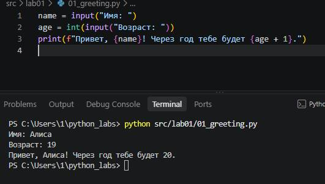
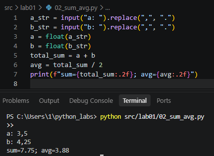
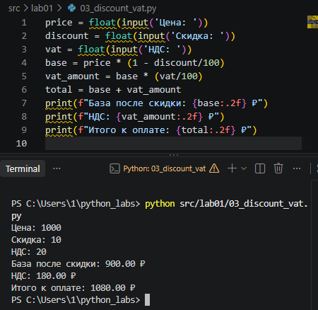
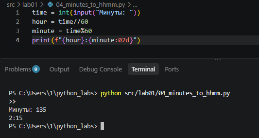
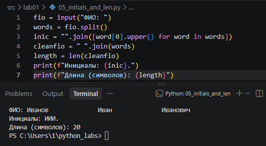

# Лабораторная работа №1: Базовый ввод/вывод и строки в Python

Выполнил студент группы БИВТ: Саид Гаджиев

## Выполнение заданий

### Задание 1: Привет и возраст
Программа просит имя и возраст пользователя, после чего выводит приветствие и возраст через год.

### Задание 2: Сумма и среднее
Программа принимает два числа и рассчитывает их сумму и среднее значение.

### Задание 3: Чек: скидка и НДС
Расчет итоговой стоимости товара с учетом скидки и налога НДС.

### Задание 4: Минуты → ЧЧ:ММ
Перевод общего количества минут в формат часов и минут.

### Задание 5: Инициалы и длина строки
Обработка строки ФИО, приведение к верхнему регистру и вывод инициалов.

