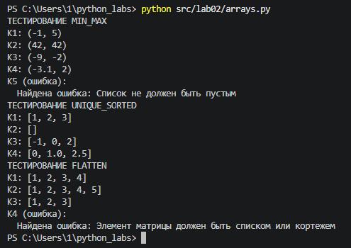
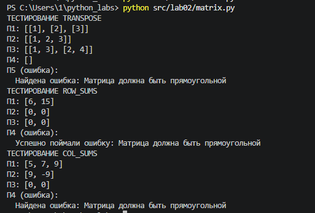
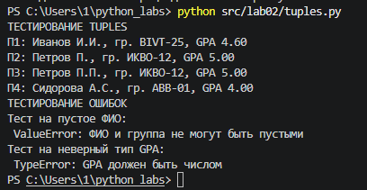

## ЛР2 — Коллекции и матрицы (list/tuple/set/dict)

### * Задание 1 — arrays.py

#### В коде реализованы функции:

- `min_max()` Возвращает кортеж (минимум, максимум). Если список пуст — ValueError.

```python
def min_max(nums: list[float | int]) -> tuple[float | int, float | int]:
    if not nums:
        raise ValueError("Список не должен быть пустым")
    return min(nums), max(nums)
```

- `unique_sorted()` Возвращает отсортированный список уникальных значений (по возрастанию).

```python
def unique_sorted(nums: list[float | int]) -> list[float | int]:
    return sorted(list(set(nums)))
```

- `flatten()` «Расплющивает» список списков/кортежей в один список по строкам (row-major). Если встретился элемент, который не является списком/кортежем — TypeError.

```python
def flatten(mat: list[list | tuple]) -> list:
    result = []
    for item in mat:
        if not isinstance(item, (list, tuple)):
            raise TypeError("Элемент матрицы должен быть списком или кортежем")
        result.extend(item)
    return result
```

#### Тест-кейсы:
Пример работы:



---

### * Задание 2 — matrix.py

#### Программа на входе получает матрицу и совершает над ней разные действия:

- `transpose()` Меняет строки и столбцы местами. Если матрица «рваная» — ValueError.

```python
def transpose(mat: list[list[float | int]]) -> list[list]:
    if not mat:
        return []
    check_rectangular(mat)
    return [list(col) for col in zip(*mat)]
```

- `row_sums()` Суммирует по каждой строке. Требуется прямоугольность.

```python
def row_sums(mat: list[list[float | int]]) -> list[float]:
    if not mat:
        return []
    check_rectangular(mat)
    return [sum(row) for row in mat]
```

- `col_sums()` Суммирует по каждому столбцу. Требуется прямоугольность.

```python
def col_sums(mat: list[list[float | int]]) -> list[float]:
    if not mat:
        return []
    check_rectangular(mat)
    return [sum(col) for col in zip(*mat)]
```

#### Тест-кейсы:
Пример работы:



---

### * Задание 3 - tuples.py

#### Код преобразовывает полученные ФИО, группу и GPA в стандартный формат со следующими правилами:
* ФИО может быть «Фамилия Имя Отчество» или «Фамилия Имя» — инициалы формируются из 1–2 имён (в верхнем регистре).
* Лишние пробелы нужно убрать (`strip`, схлопнуть внутри).
* GPA печатается с 2 знаками (округление правилами Python).

```python
def format_record(rec: tuple[str, str, float]) -> str:
    if len(rec) != 3:
        raise ValueError("Запись должна содержать 3 элемента: ФИО, группа, GPA")
    fio, group, gpa = rec
    if not isinstance(fio, str) or not isinstance(group, str):
        raise TypeError("ФИО и группа должны быть строками")
    if not fio.strip() or not group.strip():
        raise ValueError("ФИО и группа не должны быть пустыми")
    if not isinstance(gpa, (int, float)):
        raise TypeError("GPA должен быть числом")

    words = fio.split()
    last_name = words[0].capitalize()
    initials = "".join([word.upper()[0] + "." for word in words[1:]])
    return f"{last_name} {initials}, гр. {group.strip()}, GPA {gpa:.2f}"
```

#### Тест-кейсы:
Пример работы:


